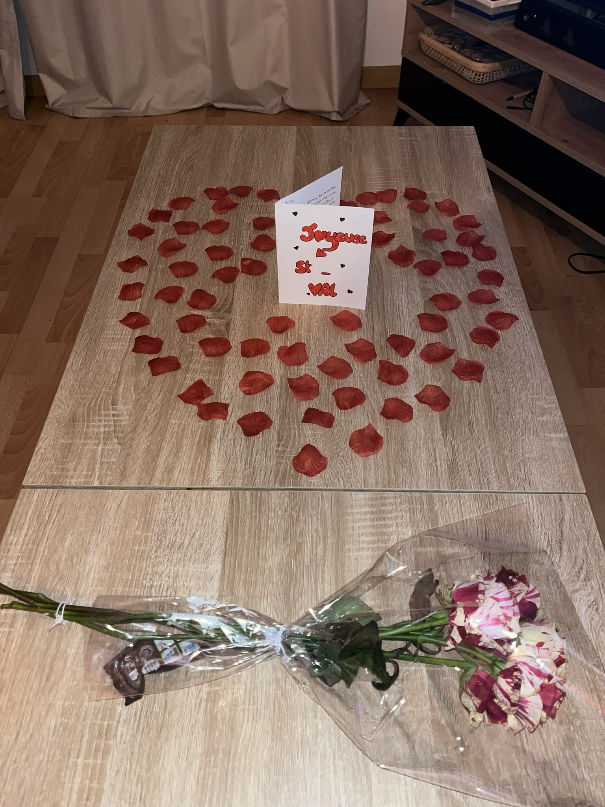
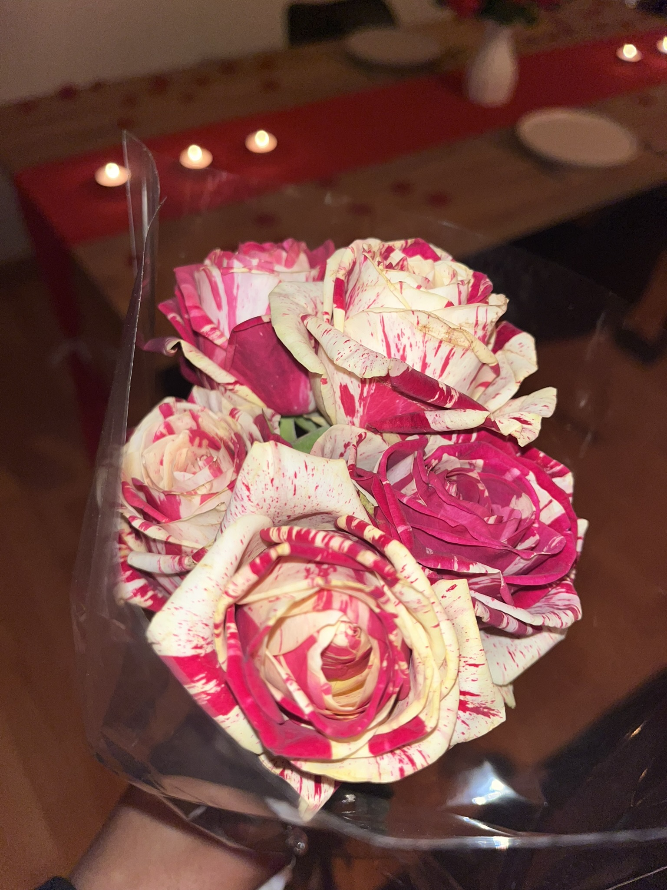

<!DOCTYPE html>
<html lang="fr">
<head>
  <meta charset="UTF-8" />
  <meta name="viewport" content="width=device-width, initial-scale=1.0" />
  <meta name="description" content="Faire-part de mariage de Lucie et Florian, le 14 mai 2027." />
  <title>Lucie & Florian — 14 mai 2027</title>

  <link rel="preconnect" href="https://fonts.googleapis.com">
  <link rel="preconnect" href="https://fonts.gstatic.com" crossorigin>
  <link href="https://fonts.googleapis.com/css2?family=Cormorant+Garamond:ital,wght@0,400;0,500;0,600;1,500&family=Montserrat:wght@300;400;500;600&display=swap" rel="stylesheet">
  <link rel="stylesheet" href="style.css" />
</head>

<body>
  

  <header class="hero" id="accueil">
    <nav class="nav">
      <a class="monogram" href="#accueil" aria-label="Retour à l'accueil">
        L
        &
        F
      </a>

      <button class="menu-button" aria-label="Ouvrir le menu" aria-expanded="false">☰</button>

      

        <a href="#histoire">Notre histoire</a>
        <a href="#mariage">Le mariage</a>
        <a href="#galerie">Galerie</a>
        <a href="#rsvp">RSVP</a>
      

    </nav>

    

    

    

    

      

        
Nous nous marions

        <h1>Lucie & Florian</h1>
        

          <b>✦</b>
        

        
14 mai 2027

        

          Nous avons le bonheur de vous inviter à célébrer notre mariage
          et à partager cette journée si précieuse à nos côtés.
        

        <a class="button button-light" href="#mariage">Découvrir la journée</a>
      

    

    <a class="scroll-indicator" href="#histoire" aria-label="Faire défiler vers le bas">
      Découvrir
      <i>⌄</i>
    </a>
  </header>

  <main>
    <section class="section story" id="histoire">
      
❦

      

        
Notre histoire

        <h2>Le plus beau chapitre commence</h2>
        
<b>✦</b>

      

      

        

          

            
          

          

            Notre aventure
            <strong>pour toujours</strong>
          

        

        

          

            Une rencontre, des souvenirs, des voyages et mille projets partagés.
          

          

            Après avoir grandi ensemble et construit notre histoire au fil des années,
            nous avons choisi d’écrire la suite main dans la main.
          

          

            Entourés des personnes qui comptent le plus pour nous, nous serons heureux
            de célébrer cette journée unique à vos côtés.
          

          <blockquote>
            « Il y a des histoires que l’on raconte, et d’autres que l’on choisit de vivre. »
          </blockquote>

          
Lucie & Florian

        

      

    </section>

    <section class="quote-band">
      

        “
        
Le plus beau voyage est celui que l’on fait ensemble.

        
      

    </section>

    <section class="section wedding" id="mariage">
      

        
Rendez-vous

        <h2>Le mariage</h2>
        
<b>✦</b>

      

      

        

          <article class="detail-card reveal">
            
01

            ◌
            <h3>La date</h3>
            
Vendredi

            <strong>14 mai 2027</strong>
          </article>

          <article class="detail-card detail-card-featured reveal">
            
02

            ⌖
            <h3>Le lieu</h3>
            
<strong>Château Arribas</strong> Condé-Sainte-Libiaire

            <a href="https://www.google.com/maps/search/?api=1&query=Ch%C3%A2teau+Arribas+Cond%C3%A9-Sainte-Libiaire" target="_blank" rel="noopener">
              Voir l'itinéraire
            </a>
          </article>

          <article class="detail-card reveal">
            
03

            ♡
            <h3>Le programme</h3>
            
Les horaires et informations pratiques seront communiqués prochainement.

          </article>
        

      

    </section>

    <section class="countdown-section" aria-label="Compte à rebours avant le mariage">
      

      

        
Encore un peu de patience

        <h2>Avant de nous dire oui</h2>
        

          
<strong id="days">000</strong>Jours

          
<strong id="hours">00</strong>Heures

          
<strong id="minutes">00</strong>Minutes

          
<strong id="seconds">00</strong>Secondes

        

      

    </section>

    <section class="section gallery" id="galerie">
      

        
Quelques souvenirs

        <h2>Notre galerie</h2>
        
<b>✦</b>

      

      

        

          Quelques images de notre histoire en attendant celles du grand jour.
          Elles pourront être remplacées très facilement plus tard.
        

      

      

        <button class="gallery-item gallery-main reveal" data-image="assets/roses.jpeg" aria-label="Agrandir la photo du bouquet">
          
          Le bouquet
        </button>

        <button class="gallery-item gallery-secondary reveal" data-image="assets/fiancailles.jpeg" aria-label="Agrandir la photo des fiançailles">
          
          Les fiançailles
        </button>

        

          

            ＋
            <strong>Votre prochaine photo</strong>
            <small>À remplacer plus tard</small>
          

        

      

    </section>

    <section class="section rsvp" id="rsvp">
      
❦

      
❦

      

        
Votre réponse

        <h2>Serez-vous des nôtres ?</h2>
        

          Nous serions ravis de partager cette journée avec vous.
          Le formulaire complet sera connecté dès que vous aurez choisi où recevoir les réponses.
        

        <form id="rsvp-form">
          

            <label>
              Prénom et nom
              <input type="text" name="name" required placeholder="Votre nom" />
            </label>

            <label>
              Nombre de personnes
              <input type="number" name="guests" min="1" max="10" value="1" required />
            </label>
          

          <fieldset>
            <legend>Votre présence</legend>
            

              <label class="radio-label">
                <input type="radio" name="attendance" value="oui" required />
                Oui, avec plaisir
              </label>

              <label class="radio-label">
                <input type="radio" name="attendance" value="non" required />
                Malheureusement non
              </label>
            

          </fieldset>

          <label>
            Message ou régime alimentaire
            <textarea name="message" rows="4" placeholder="Une information à nous transmettre ?"></textarea>
          </label>

          <button class="button button-primary" type="submit">Préparer ma réponse</button>
          
Aucune donnée n'est envoyée pour le moment.

        </form>
      

    </section>
  </main>

  <footer>
    
✦

    
Merci de faire partie de notre histoire.

    
Lucie & Florian

    
14 mai 2027

  </footer>

  <dialog class="lightbox" id="lightbox">
    <button class="lightbox-close" aria-label="Fermer">×</button>
    
  </dialog>

  
</body>
</html>
