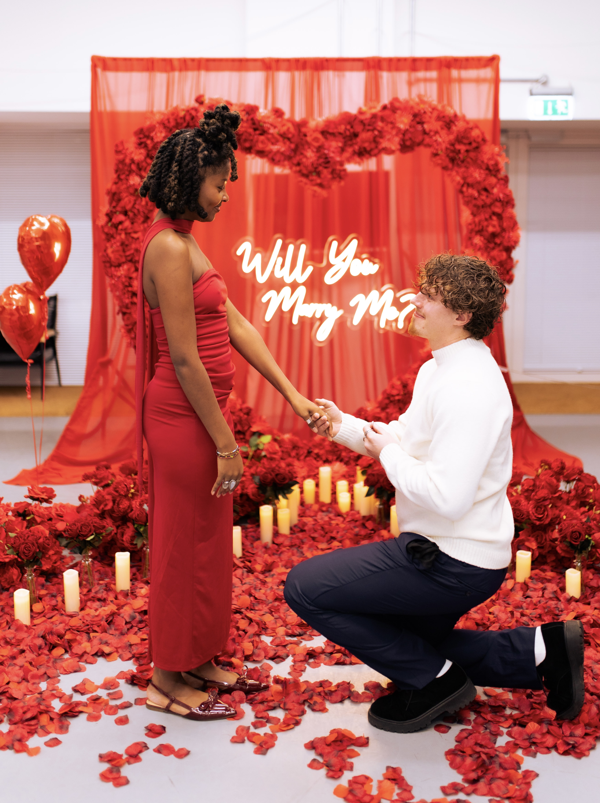
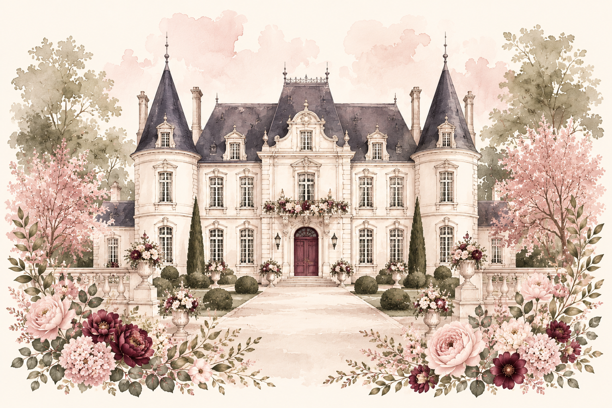
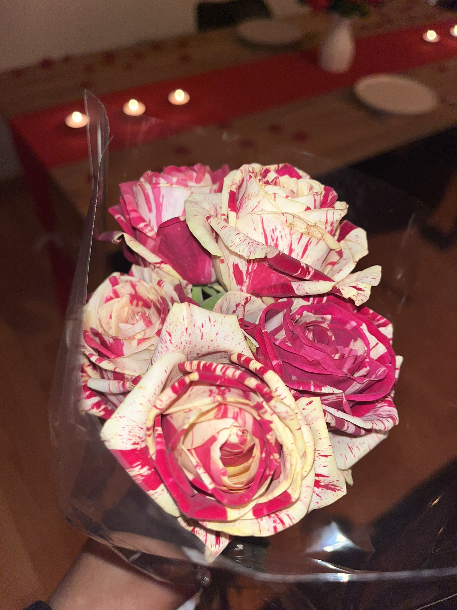
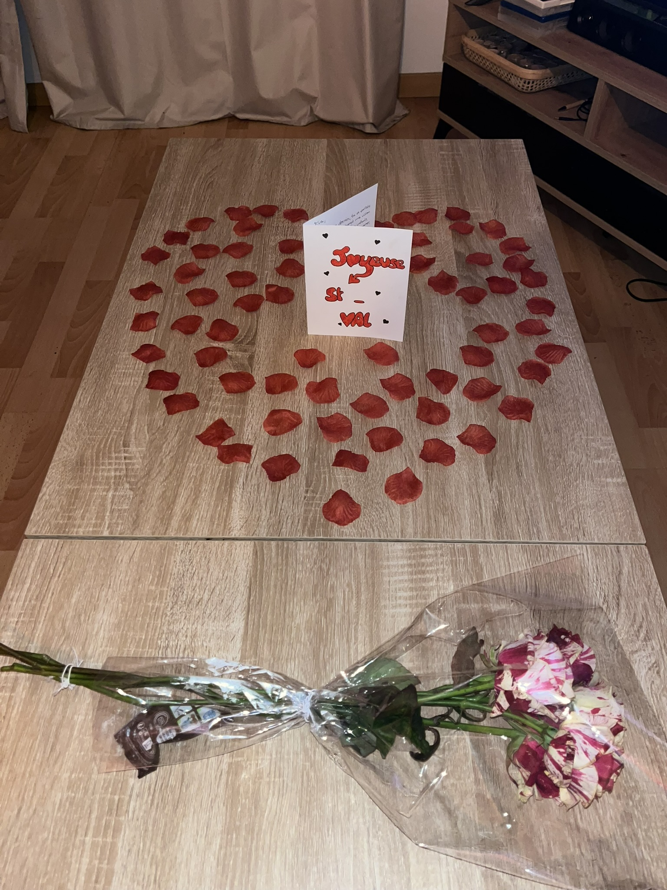

<!doctype html>
<html lang="fr">
<head>
<meta charset="utf-8">
<meta name="viewport" content="width=device-width,initial-scale=1">
<title>Lucie & Florian — 14 mai 2027</title>
<meta name="description" content="Mariage de Lucie et Florian — 14 mai 2027 au Château Arribas.">
<link rel="preconnect" href="https://fonts.googleapis.com">
<link rel="preconnect" href="https://fonts.gstatic.com" crossorigin>
<link href="https://fonts.googleapis.com/css2?family=Cormorant+Garamond:ital,wght@0,400;0,500;0,600;1,400;1,500&family=Montserrat:wght@300;400;500&display=swap" rel="stylesheet">
<link rel="stylesheet" href="style.css">
</head>
<body>
<header class="hero" id="accueil">
  <nav class="nav">
    <a class="brand" href="#accueil">L <i>&</i> F</a>
    <button class="menu" aria-label="Ouvrir le menu">☰</button>
    
<a href="#histoire">Notre histoire</a><a href="#programme">Programme</a><a href="#infos">Informations</a><a href="#rsvp">RSVP</a>

  </nav>
  

  

    
Nous allons nous marier

    <h1>Lucie <em>&</em> Florian</h1>
    
14 · 05 · 2027<i></i>Château Arribas

  

  <a class="scroll" href="#histoire">Découvrir<b>↓</b></a>
</header>

<main>
<section class="intro" id="histoire">
  
LOVE

  

  

    
Notre histoire
<h2>Une rencontre, <em>une évidence.</em></h2>
    
Tout a commencé en 2024. Une rencontre qui a doucement changé le cours de nos vies, puis l’envie de construire la suite ensemble.

    
En 2025, nos fiançailles ont ouvert un nouveau chapitre. Le 14 mai 2027, nous aurons le bonheur de le célébrer entourés des personnes qui comptent le plus pour nous.

    
<b>2024</b>Notre rencontre<b>2025</b>Nos fiançailles<b>2027</b>Notre mariage

  

</section>

<section class="statement">
Lucie & Florian
<blockquote>« Le plus beau chapitre de notre histoire commence ici. »</blockquote>14 mai 2027</section>

<section class="programme" id="programme">
  <header class="editorial-title reveal">
Le grand jour
<h2>Le programme</h2>
Une journée pensée pour célébrer, partager et profiter de chaque instant avec vous.
</header>
  

    
Château Arribas <small>Condé-Sainte-Libiaire</small>

    

      <article><small>01</small>
<h3>Cérémonie religieuse</h3>
Horaire à définir

♡</article>
      <article><small>02</small>
<h3>Vin d'honneur</h3>
Un premier moment pour trinquer ensemble.

◇</article>
      <article><small>03</small>
<h3>Dîner</h3>
Au Château Arribas.

✦</article>
      <article><small>04</small>
<h3>Soirée</h3>
Place à la fête et à la piste de danse.

♪</article>
    

  

</section>

<section class="countdown-section">
  

  

Encore un peu de patience
<h2>Avant de nous dire <em>oui</em></h2>

<b id="days">000</b>Jours

<b id="hours">00</b>Heures

<b id="minutes">00</b>Minutes

<b id="seconds">00</b>Secondes

</section>

<section class="practical" id="infos">
  <header class="editorial-title reveal">
À savoir
<h2>Quelques détails <em>avant le grand jour</em></h2></header>
  

    

    

      <article>01
<h3>Le lieu</h3>
<strong>Château Arribas</strong> Condé-Sainte-Libiaire
<a href="https://www.google.com/maps/search/?api=1&query=Ch%C3%A2teau+Arribas+Cond%C3%A9-Sainte-Libiaire" target="_blank" rel="noopener">Voir l'itinéraire ↗</a>
</article>
      <article>02
<h3>Parking</h3>
Un parking sera disponible directement sur place.

</article>
      <article>03
<h3>Dress code</h3>
Nous vous invitons à porter <strong>une touche de bordeaux</strong>.

</article>
      <article>04
<h3>Adultes uniquement</h3>
Nous avons choisi de célébrer cette journée sans enfants.

</article>
    

  

</section>

<section class="gallery-section" id="galerie">
  

Nous deux
<h2>Quelques <em>souvenirs</em></h2>

  

    <button class="gallery-item portrait reveal" data-image="assets/roses.jpeg"></button>
    <button class="gallery-item landscape reveal" data-image="assets/fiancailles.jpeg"></button>
    
∞
Et encore tant de souvenirs à créer ensemble.

  

</section>

<section class="rsvp" id="rsvp">
  

Votre réponse
<h2>Serez-vous <em>des nôtres ?</em></h2>
Votre présence rendra cette journée encore plus précieuse. Merci de confirmer votre venue avant le <strong>14 janvier 2027</strong>.

Réponse souhaitée avant le<b>14 · 01 · 2027</b>
<a class="button" id="google-form-link" href="https://docs.google.com/forms/d/e/1FAIpQLSekqj5oMctMg9l-lOC9mED1vznXfRWA3GqEtqTGSEzxQfivBA/viewform?usp=dialog">Répondre au formulaire →</a>

</section>
</main>

<footer>
Nous avons hâte de célébrer avec vous

Lucie <i>&</i> Florian
14 mai 2027 · Château Arribas</footer>
<dialog id="lightbox"><button aria-label="Fermer">×</button></dialog>

</body>
</html>
